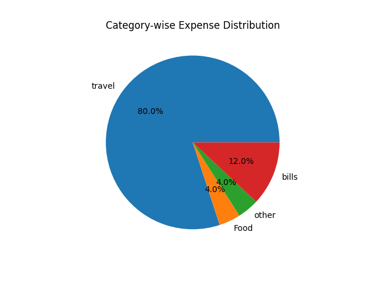

## Smart Expense Tracker

This project is a simple Python application to track daily expenses. You can add your expenses, view them, and check how much you spent in a month. It also shows which category you are spending the most on and gives small suggestions to reduce unnecessary spending.
It uses basic Python and stores data in a CSV file, so it is easy to understand and use.

